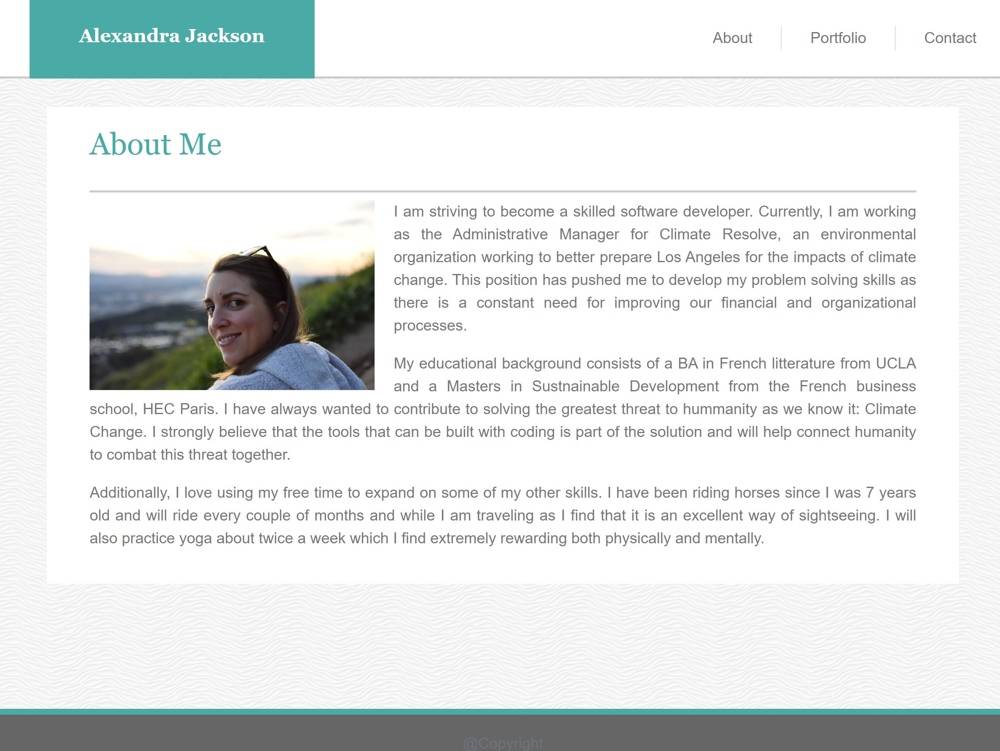
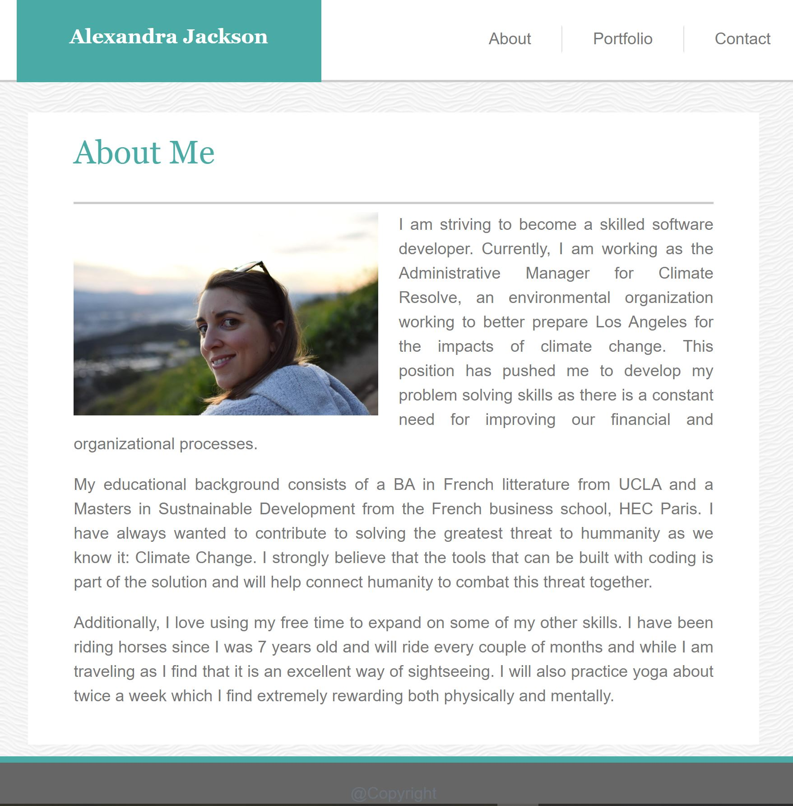
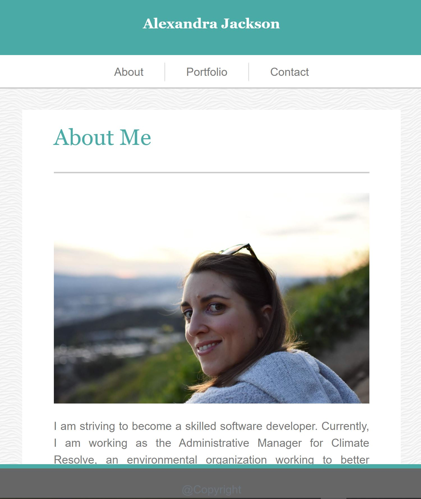
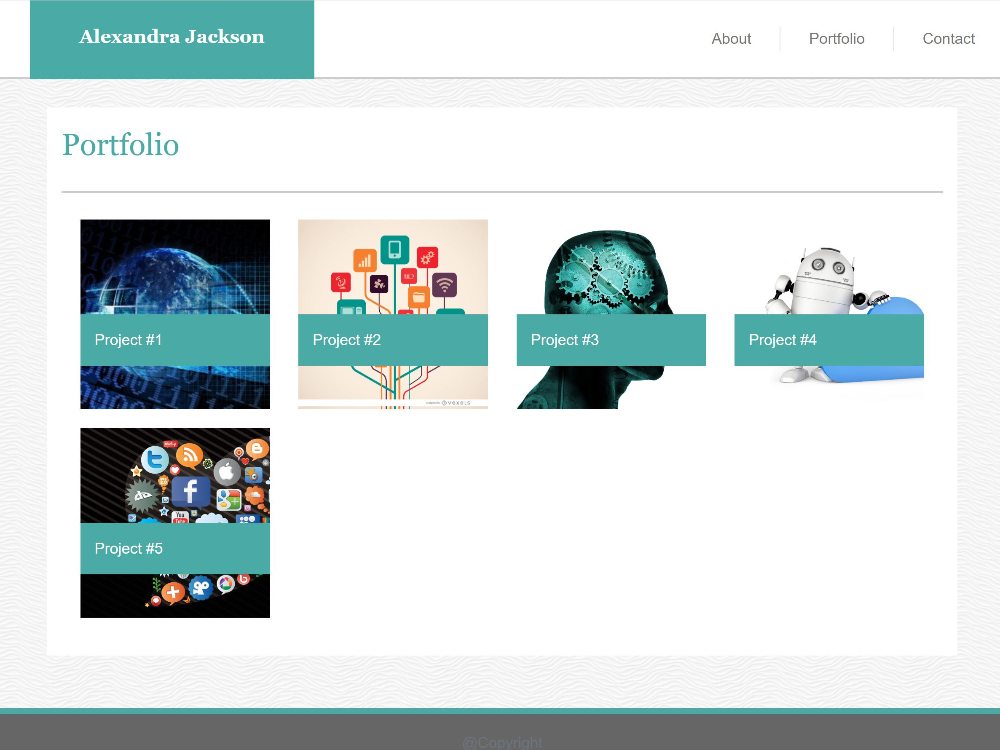
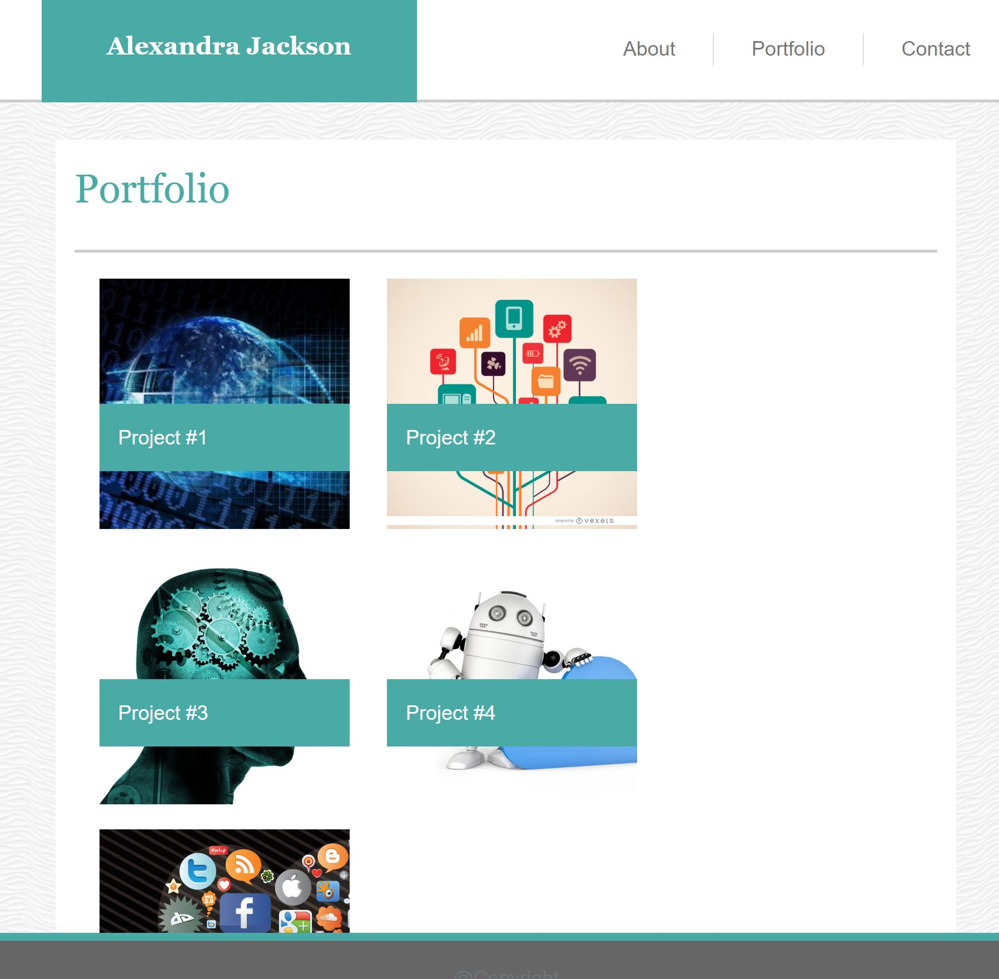
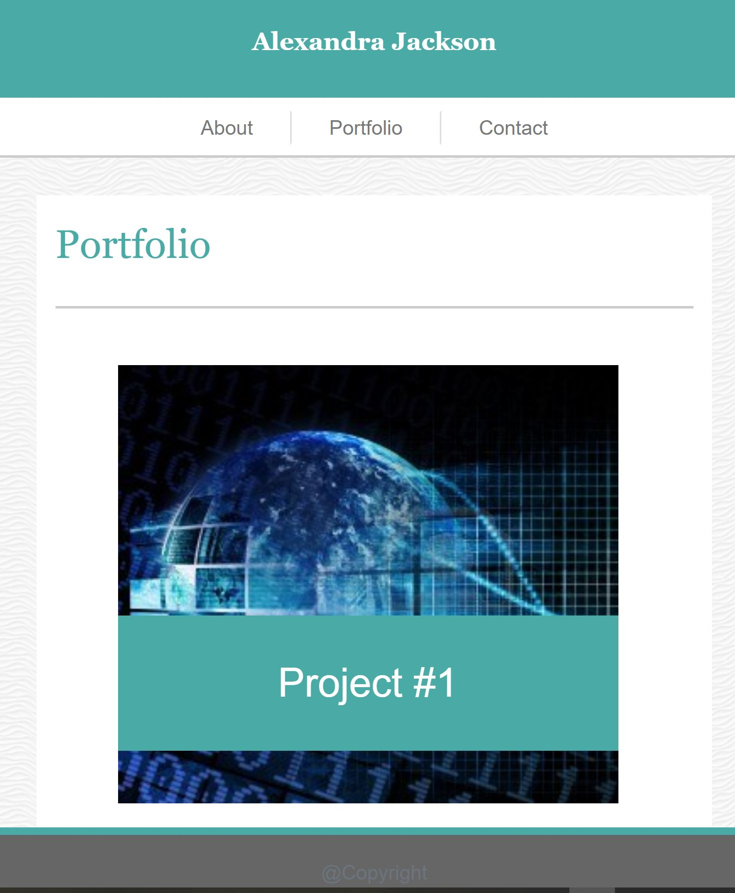
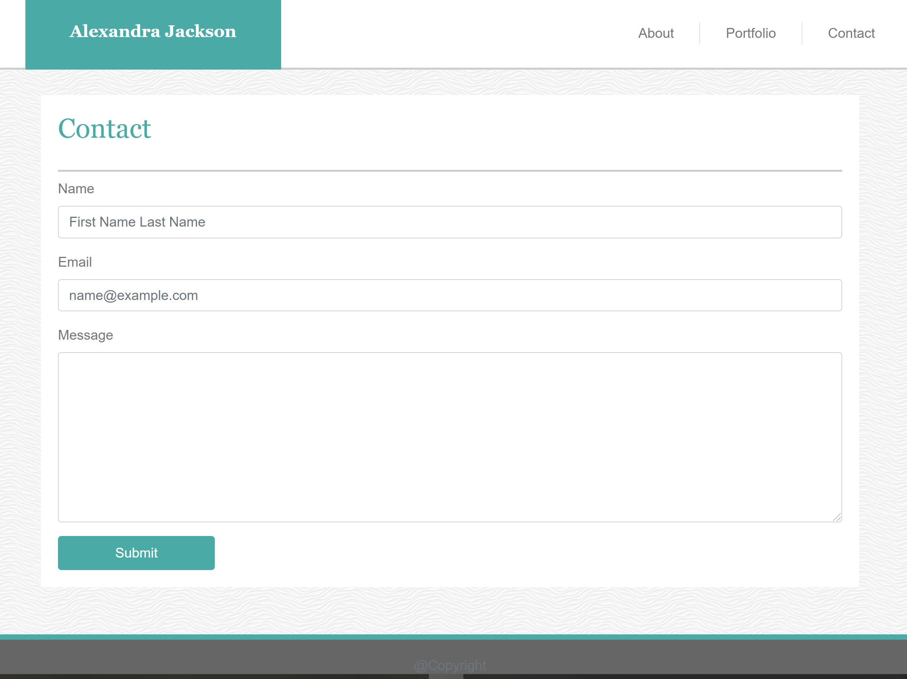
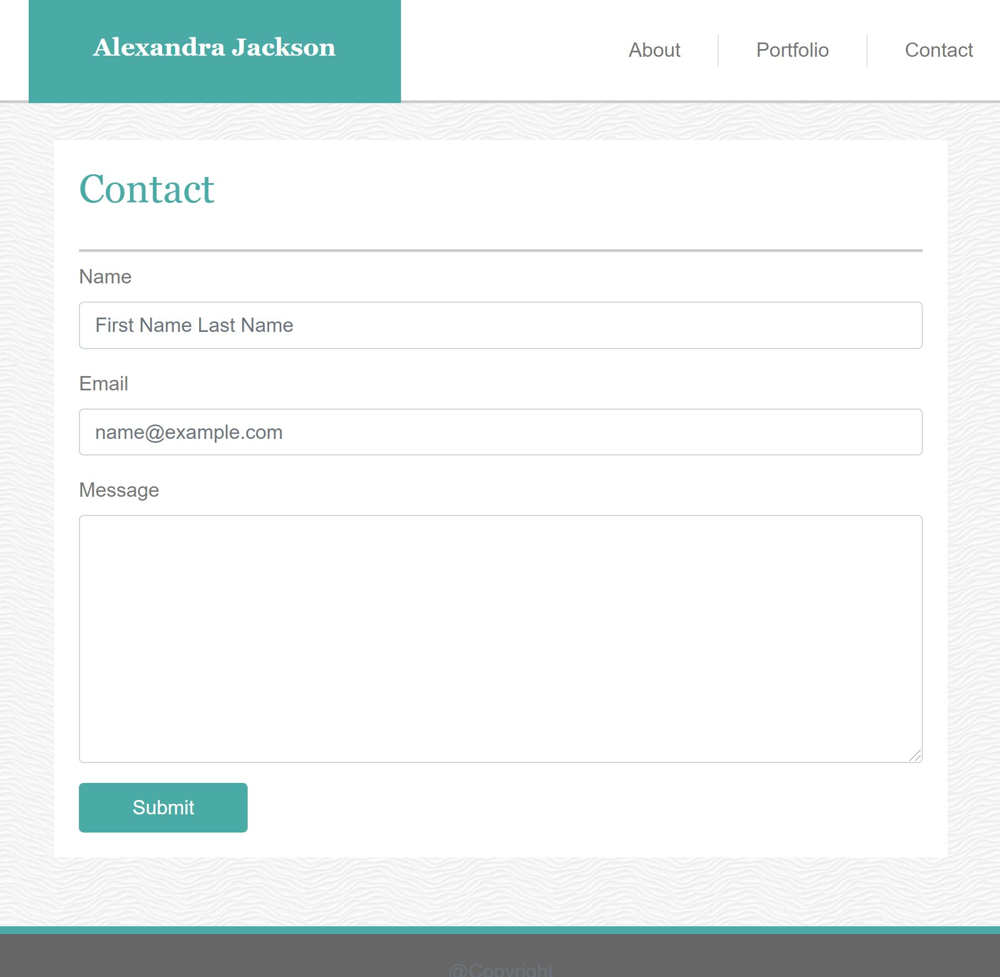
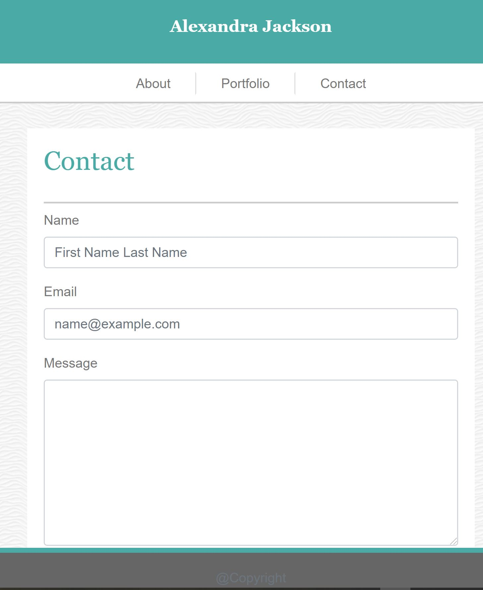

# Unit-02-Alexandra-Jackson

## Description 

The purpose for this website is to give a brief introduction to myself, showcase my projects, and enable people to contact me. 

The website is structured into three sections:
    * [About Me](https://alexandramj92.github.io/Unit-02-Alexandra-Jackson/index.html)
    * [Portfolio](https://alexandramj92.github.io/Unit-02-Alexandra-Jackson/portfolio.html)
    * [Contact](https://alexandramj92.github.io/Unit-02-Alexandra-Jackson/contact.html)

The website is also designed to be responsive. I have illustrated how they should appear at different screen sizes below. 

### About Me 

Large screen size 

Medium screen size

Small screen size

### Portfolio

Large screen size 

Medium screen size

Small screen size

### Contact

Large screen size 

Medium screen size

Small screen size

## Installation

Visual Studio Code needs to be installed in order to make modifications.
I used GitHub to store my files online. 

## Usage

The About Me section has it's code in the index.html file.
The Portfolio section has it's code in the portfolio.html file.
The Contact section has it's code in the contact.html file. 

All three html files are styled with the style.css file.

The page structure is common to all html files. The only thing that changes is the content which can be found in the sections with the ids: about-me-cont, contact-cont, and portfolio-cont. 

## Credits

I would like to thank Omar for giving me the knowledge to create a basic website using html ,bootstrap and css and the TAs for helping me work through some the issues I had with my code. 